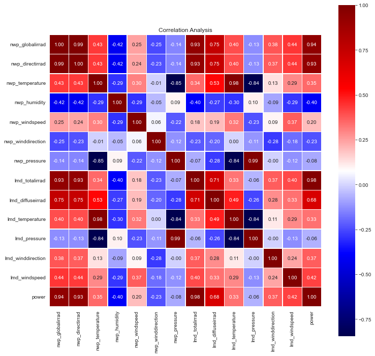
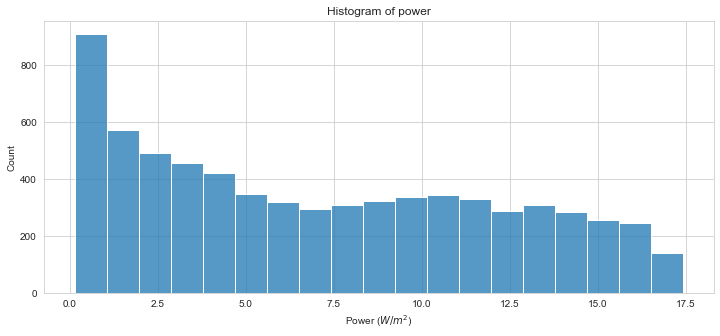
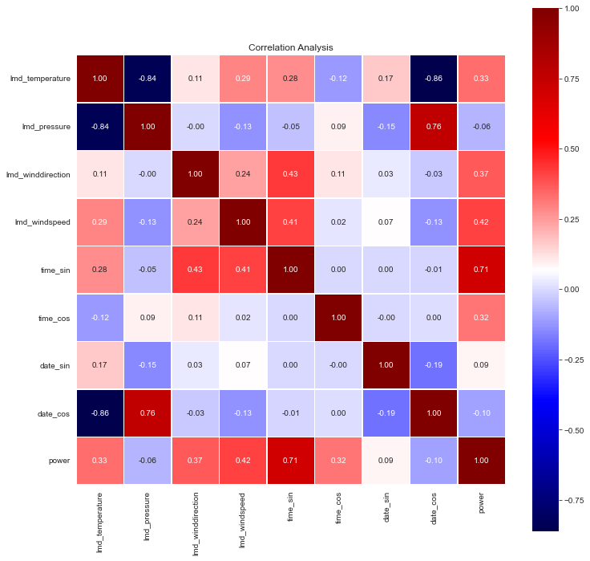
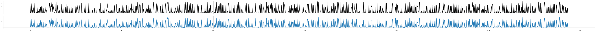

# PVOD Regression

This repository is based on a photovoltaic dataset called [PVOD](https://github.com/yaotc/PVODataset) which contains
PV power output and some weather conditions data. 

The detailed process can be viewed by checking my blog here.
[PVOD Regression - Photovoltaic power output prediction based on weather data](https://smallsquare.github.io/PVOD-regression/)

## Brief introduction

Several classical models are used in this repository.
(Random forest, Gradient boosting machine and Multi-layer perceptron)

First, checking the information of the metadata. The entire dataset is formed by data from 10 stations, but they're
separate in terms of files. So I will use `station03` as an example.

Then, some basic observation of dataset are made.

Correlation analysis:



Target feature distribution:



Also, feature engineering and feature selection are needed. The correlation of selected features is like following:



Well, we are finally ready to model. And here is the performance comparison of models with default hyper-parameters.

| Model |  MAE   |  MSE   |  RMSE  | R-square |
|:-----:|:------:|:------:|:------:|:--------:|
|  RF   | 0.5170 | 1.1366 | 1.0661 |  0.9523  |          
|  GBM  | 0.9619 | 2.5754 | 1.6048 |  0.8919  |          
|  MLP  | 1.4072 | 4.2578 | 2.0634 |  0.8213  |          

Since random forest has the best performance, we can see how close the prediction of RF made is to the ground truth.



The RF and GBM can tell the importance of features:

```
- RF Feature Importance -
lmd_temperature 
 > 9.6921 %
lmd_pressure 
 > 3.6568 %
lmd_winddirection 
 > 1.0712 %
lmd_windspeed 
 > 1.1253 %
time_sin 
 > 52.7894 %
time_cos 
 > 24.5264 %
date_sin 
 > 2.6910 %
date_cos 
 > 4.4477 %
```
```
- GBM Feature Importance -
lmd_temperature 
 > 8.7980 %
lmd_pressure 
 > 1.5802 %
lmd_winddirection 
 > 0.1962 %
lmd_windspeed 
 > 0.6686 %
time_sin 
 > 59.7374 %
time_cos 
 > 25.9409 %
date_sin 
 > 1.5174 %
date_cos 
 > 1.5614 %
```